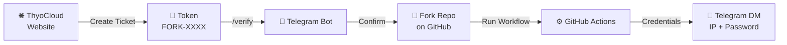

<div align="center">

[🇮🇩 Bahasa Indonesia](README.md) | **🇬🇧 English**

</div>

<div align="center">

# 🚀 ThyoCloud — Private RDP (Fork Edition)

### Your Personal Remote Desktop, Powered by GitHub Actions

[](https://t.me/thyocloud)
[](https://github.com)
[](https://thyocloud.up.railway.app)
[](https://t.me/thyocloud)
[](https://chat.whatsapp.com/D0p0nULTTheCRG9pHD6OGy)

**A dual-layer security system with fully hidden automation — from token verification to credential delivery, everything runs automatically.**

</div>

---

## 📋 Table of Contents

- [About](#-about)
- [System Flow](#-system-flow)
- [Step 1 — Creating a Token](#️-step-1--creating-an-rdp-token)
- [Step 2 — Verify & Deploy](#-step-2--verify--run-the-machine)
- [Security](#-security--privacy)
- [Support & Community](#-support--community)
- [Disclaimer](#️-disclaimer)

---

## 📖 About

**ThyoCloud Private RDP (Fork Edition)** is the official repository used to create private **Remote Desktop Protocol (RDP)** instances through a *fork-and-run* mechanism on GitHub Actions. Each user runs the workflow on their own GitHub account, so every instance is **private and fully isolated**.

> 💡 No credentials are ever printed in the Actions log. All sensitive data is sent directly to your Telegram DM.

---

## 🔄 System Flow



---

## 🛠️ Step 1 — Creating an RDP Token

| Step | Action |
|:---:|---|
| **1** | Open the **[official ThyoCloud website](https://thyocloud.up.railway.app)** and sign in to your account |
| **2** | Navigate to the **Deploy** menu and select the **Private Fork** method |
| **3** | Fill in the purpose-of-use form clearly |
| **4** | Click **Create New Ticket** to generate your access token (starts with `FORK-`) |
| **5** | Copy that token — you'll need it for the Telegram authentication step |

---

## 🔐 Step 2 — Verify & Run the Machine

| Step | Action |
|:---:|---|
| **1** | Join our official community group: **[t.me/thyocloud](https://t.me/thyocloud)** |
| **2** | Make sure you've **Started** a chat with `@ThyoCloudBot`, then type `/verify [YOUR_TOKEN]` in the group |
| **3** | Once the bot confirms your access, open this repository and click **Fork** at the top right |
| **4** | In your forked repo, open the **⚡ Actions** tab |
| **5** | If you see a yellow banner "Workflows aren't being run on this fork", click **I understand my workflows, go ahead and enable them** |
| **6** | In the left sidebar, click the **ThyoCloud Personal RDP (Fork)** workflow |
| **7** | Click the **Run workflow** dropdown on the right side (usually green) |
| **8** | A small form will appear with 2 fields — fill it in as described below |
| **9** | Click the green **Run workflow** button to start the process |
| **10** | Refresh the Actions page and click the new run to monitor progress live |

**Form field details when clicking "Run workflow":**

| Field | Required? | Fill With |
|---|:---:|---|
| `Email yang terdaftar di Web ThyoCloud` (registered email) | ✅ Required | The exact same email you used when creating your ticket/token on the website |
| `Username RDP (Opsional - Default: thyocloud)` | ❌ Optional | Leave blank to auto-use `thyocloud`, or enter a custom username |

> ⚠️ **Important:** The email entered here **must match exactly** the email registered when creating your token on the website. If it doesn't match, the process will automatically fail (`⛔ FAILED`) because the system can't verify your identity.

```
/verify FORK-XXXXXXXXXX
```

**After the workflow finishes (± 1-3 minutes):** Your IP, Username, and Password will be sent automatically to your **Telegram DM** by the bot — not shown in the Actions log.

---

## 🛡️ Security & Privacy

<table>
<tr>
<td width="50%">

### ✅ What We Do
- 🔒 Credentials are **never** shown in the Actions log
- 📨 IP & Password are sent **automatically via Telegram DM**
- 🎫 Every token is **single-use** & bound to one Telegram account
- 🔁 **Anti-abuse system** detects duplicate active RDPs

</td>
<td width="50%">

### ⚠️ Your Responsibility
- 🚫 Never share your token with anyone
- 🔐 Never make workflow logs public
- 🕒 Keep track of your active server's usage time
- 📩 Check your bot DM promptly after the workflow finishes

</td>
</tr>
</table>

---

## 📞 Support & Community

<div align="center">

[](https://thyocloud.up.railway.app)
[](https://t.me/thyocloud)
[](https://chat.whatsapp.com/D0p0nULTTheCRG9pHD6OGy)

</div>

---

## ⚠️ Disclaimer

This service is provided **as-is** for personal/educational purposes. Users are fully responsible for ensuring their usage complies with **GitHub's Terms of Service** and those of any other related platforms.

<div align="center">

**Made with ❤️ by ThyoCloud Team**

</div>
