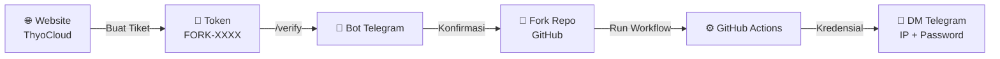

<div align="center">

**🇮🇩 Bahasa Indonesia** | [🇬🇧 English](README.en.md)

</div>

<div align="center">

# 🚀 ThyoCloud — Private RDP (Fork Edition)

### Remote Desktop Pribadi, Ditenagai GitHub Actions

[](https://t.me/thyocloud)
[](https://github.com)
[](https://thyocloud.up.railway.app)
[](https://t.me/thyocloud)
[](https://chat.whatsapp.com/D0p0nULTTheCRG9pHD6OGy)

**Sistem otomatisasi dengan lapisan keamanan ganda — dari verifikasi token hingga pengiriman kredensial, semua berjalan otomatis dan tersembunyi.**

</div>

---

## 📋 Daftar Isi

- [Tentang Proyek](#-tentang-proyek)
- [Alur Kerja Sistem](#-alur-kerja-sistem)
- [Langkah 1 — Membuat Token](#️-langkah-1--membuat-token-rdp)
- [Langkah 2 — Verifikasi & Deploy](#-langkah-2--verifikasi--menjalankan-mesin)
- [Keamanan](#-keamanan--privasi)
- [Bantuan & Komunitas](#-pusat-bantuan--komunitas)
- [Disclaimer](#️-disclaimer)

---

## 📖 Tentang Proyek

**ThyoCloud Private RDP (Fork Edition)** adalah repositori resmi yang digunakan untuk membuat instance **Remote Desktop Protocol (RDP)** pribadi lewat mekanisme *fork-and-run* di GitHub Actions. Setiap pengguna menjalankan workflow-nya sendiri di akun GitHub masing-masing, sehingga setiap instance bersifat **privat dan terisolasi**.

> 💡 Tidak ada log kredensial yang tampil di layar Actions. Semua data sensitif dikirim langsung ke DM Telegram Anda.

---

## 🔄 Alur Kerja Sistem



---

## 🛠️ Langkah 1 — Membuat Token RDP

| Langkah | Aksi |
|:---:|---|
| **1** | Buka **[website resmi ThyoCloud](https://thyocloud.up.railway.app)** dan masuk menggunakan sesi akun Anda |
| **2** | Navigasikan ke menu **Deploy**, pilih metode **Private Fork** |
| **3** | Lengkapi formulir tujuan penggunaan server virtual dengan jelas |
| **4** | Klik **Buat Tiket Baru** untuk menghasilkan token akses (berawalan `FORK-`) |
| **5** | Salin token tersebut untuk tahap otentikasi Telegram berikutnya |

---

## 🔐 Langkah 2 — Verifikasi & Menjalankan Mesin

| Langkah | Aksi |
|:---:|---|
| **1** | Bergabung ke grup komunitas resmi: **[t.me/thyocloud](https://t.me/thyocloud)** |
| **2** | Pastikan sudah **Start** obrolan dengan `@ThyoCloudBot`, lalu ketik `/verify [TOKEN_ANDA]` di grup |
| **3** | Setelah bot mengonfirmasi akses, buka repositori ini dan klik **Fork** di kanan atas |
| **4** | Di repo hasil fork Anda, buka tab **⚡ Actions** |
| **5** | Jika muncul peringatan kuning "Workflows aren't being run on this fork", klik tombol **I understand my workflows, go ahead and enable them** |
| **6** | Di sidebar kiri, klik workflow **ThyoCloud Personal RDP (Fork)** |
| **7** | Klik dropdown **Run workflow** di sisi kanan (biasanya berwarna hijau) |
| **8** | Akan muncul form kecil berisi 2 kolom isian — isi sesuai tabel di bawah |
| **9** | Klik tombol hijau **Run workflow** untuk memulai proses |
| **10** | Refresh halaman Actions, klik run yang baru muncul untuk memantau progres secara live |

**Detail kolom form saat klik "Run workflow":**

| Kolom | Wajib? | Isi Dengan |
|---|:---:|---|
| `Email yang terdaftar di Web ThyoCloud` | ✅ Wajib | Email yang sama persis dengan yang Anda gunakan saat membuat tiket/token di website |
| `Username RDP (Opsional - Default: thyocloud)` | ❌ Opsional | Boleh dikosongkan (otomatis pakai `thyocloud`), atau isi username custom sesuai keinginan |

> ⚠️ **Penting:** Email yang dimasukkan di form ini **harus sama** dengan email yang terdaftar saat pembuatan token di website. Jika berbeda, proses akan otomatis gagal (`⛔ GAGAL`) karena sistem tidak bisa mencocokkan verifikasi Anda.

```
/verify FORK-XXXXXXXXXX
```

**Setelah workflow selesai (± 1-3 menit):** Kredensial IP, Username, dan Password akan otomatis dikirim ke **DM Telegram** Anda oleh bot — bukan ditampilkan di log Actions.

---

## 🛡️ Keamanan & Privasi

<table>
<tr>
<td width="50%">

### ✅ Yang Kami Lakukan
- 🔒 Kredensial **tidak pernah** tampil di log Actions
- 📨 IP & Password dikirim **otomatis via DM Telegram**
- 🎫 Setiap token **sekali pakai** & terikat 1 akun Telegram
- 🔁 Sistem **anti-abuse** mendeteksi RDP aktif ganda

</td>
<td width="50%">

### ⚠️ Tanggung Jawab Anda
- 🚫 Jangan bagikan token ke siapa pun
- 🔐 Jangan publikasikan hasil log workflow ke publik
- 🕒 Perhatikan durasi pemakaian aktif server
- 📩 Segera cek DM bot setelah workflow selesai

</td>
</tr>
</table>

---

## 📞 Pusat Bantuan & Komunitas

<div align="center">

[](https://thyocloud.up.railway.app)
[](https://t.me/thyocloud)
[](https://chat.whatsapp.com/D0p0nULTTheCRG9pHD6OGy)

</div>

---

## ⚠️ Disclaimer

Layanan ini disediakan **apa adanya (as-is)** untuk keperluan pribadi/edukasi. Pengguna bertanggung jawab penuh atas penggunaan resource sesuai dengan **Ketentuan Layanan (Terms of Service) GitHub** dan platform terkait lainnya.

<div align="center">

**Made with ❤️ by ThyoCloud Team**

</div>
